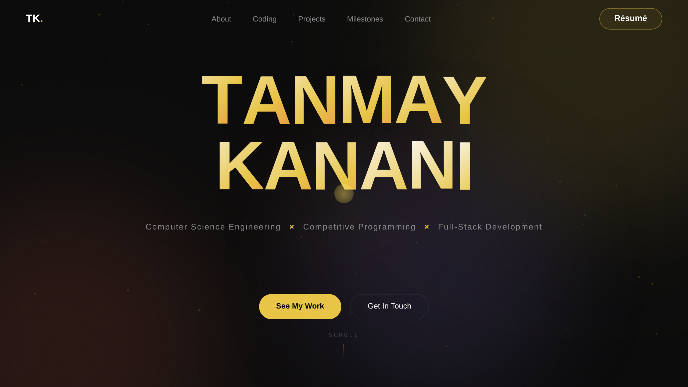
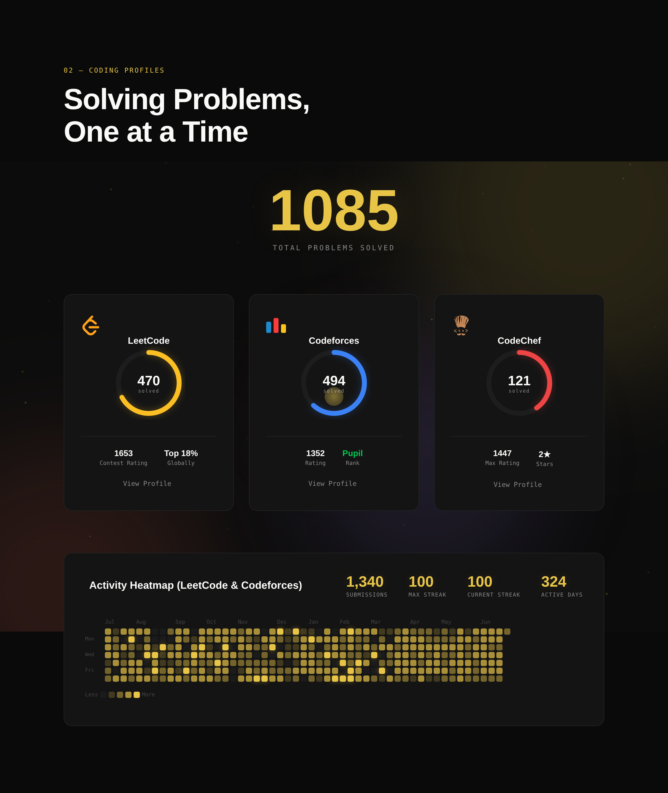

<div align="center">

# Tanmay Kanani — Portfolio

**Software Engineer · Competitive Programmer · Full-Stack Developer**

A fast, animated single-page portfolio with live competitive-programming stats,
a GitHub-style activity heatmap, and a working contact form — built with plain
HTML, CSS, and vanilla JavaScript. No framework, no build step.

[**📄 Résumé**](./Tanmay_Kanani_Resume.pdf)



</div>

## ✨ Highlights

- **Live coding stats** — LeetCode & Codeforces solved counts and ratings, plus a
  merged GitHub-style **activity heatmap**, fetched client-side with resilient
  fallbacks so the section never looks broken.
- **Motion & interaction** — a cinematic intro preloader, a GSAP hero reveal,
  scroll-parallax headings, a velocity-reactive marquee, magnetic buttons, an
  interactive particle field, and hover "scramble" text.
- **Working contact form** — delivers straight to email via **Web3Forms**; no
  backend required.
- **Fully responsive** — tuned for mobile, with a full-screen menu and a
  touch-reactive background.



## 🛠 Built with

`HTML5` · `CSS3` · `Vanilla JavaScript` · `GSAP` · `Web3Forms`

## 🚀 Run locally

```bash
# from the project folder
python -m http.server 8000
# then open http://localhost:8000
```

> Serve over **http** (not `file://`) so the live API calls and the contact form work.

## 📁 Structure

```
.
├── index.html                 # markup
├── style.css                  # styles & responsive design
├── script.js                  # interactions, live stats, heatmap, contact form
├── Tanmay_Kanani_Resume.pdf   # résumé
└── assets/                    # preview images
```

## 📫 Contact

- **Email** — tanmaykanani8@gmail.com
- **LinkedIn** — [tanmay-kanani](https://www.linkedin.com/in/tanmay-kanani-163875333/)
- **LeetCode** — [Tanmay_Kanani](https://leetcode.com/u/Tanmay_Kanani/)
- **Codeforces** — [tanmay.k](https://codeforces.com/profile/tanmay.k)

## 📄 License

Released under the [MIT License](./LICENSE).

<div align="center"><sub>Designed &amp; built by Tanmay Kanani.</sub></div>
